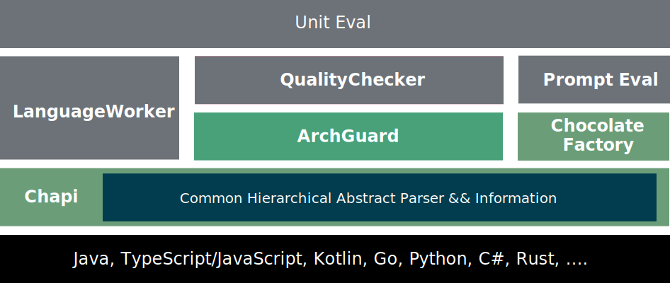
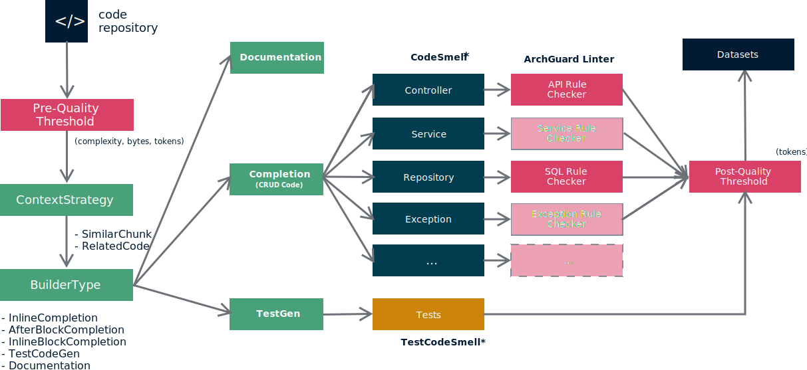

<h1 align="center">UnitGen - Code Fine-tuning Data Framework</h1>

<p align="center">
  <a href="https://github.com/unit-mesh/unit-gen/actions/workflows/build.yml">
    
  </a>
  <a href="https://github.com/unit-mesh/chocolate-factory">
    
  </a>
  <a href="https://central.sonatype.com/artifact/cc.unitmesh/unit-picker">
    
  </a>
</p>

> UnitGen 是一个代码微调的数据框架，可以直接从你的代码库中生成微调数据：代码补全、测试生成、文档生成等。

Examples:

| name          | model download (HuggingFace)                                              | finetune Notebook                    | model download (OpenBayes)                                                          |
|---------------|---------------------------------------------------------------------------|--------------------------------------|-------------------------------------------------------------------------------------|
| DeepSeek 6.7B | [unit-mesh/autodev-coder](https://huggingface.co/unit-mesh/autodev-coder) | [finetune.ipynb](finetunes/deepseek) | [AutoDev Coder](https://openbayes.com/console/phodal/models/rCmer1KQSgp/9/overview) |
| CodeGeeX2 6B  | TODO                                                                      | TODO                                 |

Features:

- Code context
  strategy: [Related code completion](https://gen.unitmesh.cc/instruction/related-code-completion), [Similar Code Completion](https://gen.unitmesh.cc/instruction/similar-code-completion)
- Completion type: inline, block, after block
- [Code quality](https://gen.unitmesh.cc/quality) filter and pipeline. Code smell, test smell, estimation nd more.

## Architecture

Layered Architecture



Workflow



### Design Philosophy

- Unique prompt. Integrated use of fine-tuning, evaluation, and tooling.
- Code quality pipeline. With estimate with code complex, bad smell, test bad smell, and more rules.
- Extendable customize quality thresholds. Custom rules, custom thresholds, custom quality type or more.

### Unique Prompt

Keep the same prompt: AutoDev <-> UnitGen <-> UnitEval

#### AutoDev prompt

AutoDev prompt template example:

    Write unit test for following code.
    
    ${context.coc}
    
    ${context.framework}
    
    ${context.related_model}
    
    ```${context.language}
    ${context.selection}
    ```

#### Unit Picker prompt

Unit Picker prompt should keep the same structure as the AutoDev prompt. Prompt example:

```kotlin
val input = "$relatedCode\n\nCode:\n```${language}\n$beforeCursor\n```"
return Instruction(
    instruction = "Complete $language code, return rest code, no explaining",
    output = output,
    input = input
)
```

#### UnitGen prompt

UnitGen prompt should keep the same structure as the AutoDev prompt. Prompt example:

    Complete ${language} code, return rest code, no explaining
    
    ```${language}
    ${relatedCode}
    ```
    
    Code:
    ```${language}
    ${beforeCursor}
    ```

### Code quality pipeline


### Extendable customize quality thresholds

Optional quality type:

```kotlin
enum class CodeQualityType {
    BadSmell,
    TestBadSmell,
    JavaController,
    JavaRepository,
    JavaService,
}
```

Custom thresholds' config:

```kotlin
data class BsThresholds(
    val bsLongParasLength: Int = 5,
    val bsIfSwitchLength: Int = 8,
    val bsLargeLength: Int = 20,
    val bsMethodLength: Int = 30,
    val bsIfLinesLength: Int = 3,
)
```

Custom rules:

```kotlin
val apis = apiAnalyser.toContainerServices()
val ruleset = RuleSet(
    RuleType.SQL_SMELL,
    "normal",
    UnknownColumnSizeRule(),
    LimitTableNameLengthRule()
    // more rules
)

val issues = WebApiRuleVisitor(apis).visitor(listOf(ruleset))
// if issues are not empty, then the code has bad smell
```

## Thanks to

- abstract syntax tree: [Chapi](https://github.com/phodal/chapi). Used features: multiple language to same data
  structure.
- legacy system analysis: [Coca](https://github.com/phodal/coca). Inspired: Bad Smell, Test Bad Smell
- architecture governance tool: [ArchGuard](https://github.com/archguard/archguard).
  Used features: Estimation, Rule Lint (API, SQL)
- code database [CodeDB](https://github.com/archguard/codedb). Used features: Code analysis pipeline
